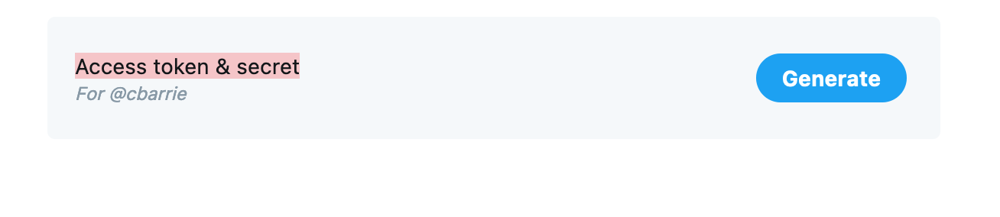

# Using APIs and web scraping

In this worksheet, we will see how to access data through an API (the client side). The first example uses a dedicated package, which I created with Juston Ho and Chung-hong Chan, called <tt>academictwitteR</tt>; the second does not rely on a pre-packaged library and instead forces us to write our own `GET` requests to the API. This is the same as any R package or other pre-packaged library is doing---if you looked undernearth the hood of <tt>academictwitteR</tt> this is what you would find!

## Tutorial: APIs 

In this tutorial, you will learn how to:

* Get developer access credentials to Twitter
* Get Academic Research Product Track access credentials to Twitter
* Use the <tt>academictwitteR</tt> package to query the Twitter API
* Go through different ways to interact with the Twitter Academic API
* Build our own `GET` requests with the <tt>httr</tt> package

## Setup 

In order to use the Twitter Academic Research Product Track you will first need to obtain an authorization token. You will find details about the process of obtaining authorization [here](https://developer.twitter.com/en/solutions/academic-research/application-info). 

**In order to gain authorization you first need a Twitter account.**

First, Twitter will ask for details about your academic profile. Per the documentation linked above, they will ask for the following:

> Your full name as it is appears on your institution’s documentation
> 
>   Links to webpages that help establish your identity; provide one or more of the following:
> 
>   - A link to your profile in your institution’s faculty or student directory
>   - A link to your Google Scholar profile
>   - A link to your research group, lab or departmental website where you are listed
> 
>   Information about your academic institution: its name, country, state, and city
> 
>   Your department, school, or lab name
> 
>   Your academic field of study or discipline at this institution
> 
>   Your current role as an academic (whether you are a graduate student, doctoral candidate,       post-doc, professor, research scientist, or other faculty member)

Twitter will then ask for details of the proposed research project. Here, questions include:

> 1. What is the name of your research project?
>
> 2. Does this project receive funding from outside your academic institution? If yes, please list all your sources of funding.
>
> 3. In English, describe your research project. Minimum 200 characters.
>
> 4. In English, describe how Twitter data via the Twitter API will be used in your research project. Minimum 200 characters.
>
> 5. In English, describe your methodology for analyzing Twitter data, Tweets, and/or Twitter users. Minimum 200 characters.
>
> 6. Will your research present Twitter data individually or in aggregate?
>
> 7. In English, describe how you will share the outcomes of your research (include tools, data, and/or other resources you hope to build and share). Minimum 200 characters.
>
> 8. Will your analysis make Twitter content or derived information available to a government entity?

Once you have gained authorization for your project you will be able to see the new project on your Twitter developer portal. First click on the developer portal as below. 

{width=80%}


Here you will see your new project, and the name you gave it, appear on the left hand side. Once you have associated an App with this project, it will also appear below the name of the project. Here, I have several Apps authorized to query the basic API. I have one App, named "gencap", that is associated with my Academic Research Product Track project. 


{width=80%}


When you click on the project, you will first see how much of your monthly cap of 10m tweets you have spent. You will also see the App associated with your project below the monthly tweet cap usage information.


{width=80%}


By clicking on the Settings icons for the App, you will be taken through to the information about the App associated with the project. Here, you will see two options listed, for "Settings" and "Keys and Tokens."


{width=80%}


Beside the panel for Bearer Token, you will see an option to Regenerate the token. You can do this if you have not stored the information about the token and no longer have access to it. It is important to store information on the Bearer Token to avoid having to continually regenerate the Bearer Token information.


{width=80%}


Once you have the Bearer Token, you are ready to use `academictwitteR`!

##  Load data and packages 

Before proceeding, we'll load the remaining packages we will need for this section.


```r
library(tidyverse) # loads dplyr, ggplot2, and others
library(academictwitteR) # to query the Academic Research Product Track Twitter v2 API endpoint in R
```

## The Twitter Academic Research Product Track

The Academic Research Product Track permits the user to access larger volumes of data, over a far longer time range, than was previously possible. From the Twitter [documentation](https://developer.twitter.com/en/solutions/academic-research/application-info):

> "The Academic Research product track includes full-archive search, as well as increased access and other v2 endpoints and functionality designed to get more precise and complete data for analyzing the public conversation, at no cost for qualifying researchers. Since the Academic Research track includes specialized, greater levels of access, it is reserved solely for non-commercial use".

The new "v2 endpoints" refer to the v2 API, introduced around the same time as the new Academic Research Product Track. Full details of the v2 endpoints are available [here](https://developer.twitter.com/en/docs/twitter-api/early-access).

In summary the Academic Research product track allows the authorized user:

1. Access to the full archive of (as-yet-undeleted) tweets published on Twitter
2. A higher monthly tweet cap (10m--or 20x what was previously possible with the standard v1.1 API)
3. Ability to access these data with more precise filters permitted by the v2 API


## Querying the Twitter API with `academictwitteR`

The first task is set authorization credentials with the `set_bearer()` function, which allows the user to store their bearer token in the .Renviron file.

To do so, use:


```r
set_bearer()
```

and enter authorization credentials as below:


This will mean that the bearer token is automatically called during API calls. It also avoids the inadvisable practice of hard-coding authorization credentials into scripts. 

## Collecting tweets

The workhorse function is `get_all_tweets()`, which is able to collect tweets matching a specific search query or all tweets by a specific set of users.


```r
tweets <-
  get_all_tweets(
    query = "#BlackLivesMatter",
    start_tweets = "2020-01-01T00:00:00Z",
    end_tweets = "2020-01-05T00:00:00Z",
    file = "blmtweets",
    data_path = "data/",
    n = 1000000,
  )
```

Here, we are collecting tweets containing a hashtag related to the Black Lives Matter movement over the period January 1, 2020 to January 5, 2020. 

We have also set an upper limit of one million tweets. When collecting large amounts of Twitter data we recommend including a `data_path` and setting `bind_tweets = FALSE` such that data is stored as JSON files and can be bound at a later stage upon completion of the API query.


```r
tweets <-
  get_all_tweets(
    users = c("jack", "cbarrie"),
    start_tweets = "2020-01-01T00:00:00Z",
    end_tweets = "2020-01-05T00:00:00Z",
    file = "blmtweets",
    n = 1000
  )
```

Whereas here we are not specifying a search query and instead are requesting all tweets by users "@jack" and "@cbarrie" over the period January 1, 2020 to January 5, 2020. Here, we set an upper limit of 1000 tweets.

The search query and user query arguments can be combined in a single API call as so:


```r
get_all_tweets(
  query = "twitter",
  users = c("cbarrie", "jack"),
  start_tweets = "2020-01-01T00:00:00Z",
  end_tweets = "2020-05-01T00:00:00Z",
  n = 1000
)
```

Where here we would be collecting tweets by users "@jack" and "@cbarrie" over the period January 1, 2020 to January 5, 2020 containing the word "twitter."


```r
get_all_tweets(
  query = c("twitter", "social"),
  users = c("cbarrie", "jack"),
  start_tweets = "2020-01-01T00:00:00Z",
  end_tweets = "2020-05-01T00:00:00Z",
  n = 1000
)
```

While here we are collecting tweets by users "@jack" and "@cbarrie" over the period January 1, 2020 to January 5, 2020 containing the words "twitter" or "social."

Note that the "AND" operator is implicit when specifying more than one character string in the query. See [here](https://developer.twitter.com/en/docs/twitter-api/tweets/search/integrate/build-a-query) for information on building queries for search tweets. Thus, when searching for all elements of a character string, a call may look like:


```r
get_all_tweets(
  query = c("twitter social"),
  users = c("cbarrie", "jack"),
  start_tweets = "2020-01-01T00:00:00Z",
  end_tweets = "2020-05-01T00:00:00Z",
  n = 1000
)
```

, which will capture tweets containing *both* the words "twitter" and "social." The same logics apply for hashtag queries.

Whereas if we specify our query as separate elements of a character vector like this:


```r
get_all_tweets(
  query = c("twitter", "social"),
  users = c("cbarrie", "jack"),
  start_tweets = "2020-01-01T00:00:00Z",
  end_tweets = "2020-05-01T00:00:00Z",
  n = 1000
)
```
, this will be capturing tweets by users "@cbarrie" or "@jack" containing the words "twitter" *or* social. 

Finally, we may wish to query an exact phrase. To do so, we can either input the phrase in escape quotes, e.g., `query ="\"Black Lives Matter\""` or we can use the optional parameter `exact_phrase = T` to search for tweets containing the exact phrase string:


```r
tweets <-
  get_all_tweets(
    query = "#BlackLivesMatter",
    start_tweets = "2020-01-01T00:00:00Z",
    end_tweets = "2020-01-05T00:00:00Z",
    file = "blmtweets",
    data_path = "data/",
    n = 1000000,
  )
```

Here, we are collecting tweets containing a hashtag related to the Black Lives Matter movement over the period January 1, 2020 to January 5, 2020. 

## Building a query 

The v2 Twitter API allows for greater precision when making queries. A query might just be a single string like "happy new year" if you're interested on how people are celebrating on the night of December 31. Alternatively, the query might involve several additional operators that filter tweets with greater precision to return specific tweet content. 

This vignette guides you through the logics underpinning queries to the Twitter API. For full information on these logics you may additionally wish to consult the Twitter API documentation on how to build a query [here](https://developer.twitter.com/en/docs/twitter-api/tweets/search/integrate/build-a-query).

## Query strings

We first load our package into memory with:


```r
library(academictwitteR)
```

We then make sure we have set our bearer token appropriately by calling:


```r
get_bearer()
```


```
## [1] "AAAAAAAAAAAAAAAAAAAAAPw%2BJQEAAAAAq5Ot8BBYyYlAqT9nLMuVuR1jI5fA%3DqG9HTHISISNOTAREALTOKEN"
```

Let's say we were interested in what people were talking about on New Year's Eve. We might do something like this:


```r
tweets <-
  get_all_tweets(
    query = "happy",
    start_tweets = "2019-12-31T10:00:00Z",
    end_tweets = "2020-01-01T10:00:00Z",
    n = 10000
  )
```

Note here that we have also specified an upper limit of 10,000 tweets. The default is 100. For most applications, the user will need to specify a higher n than the default. 

The default upper limit is set to 100 in order to prevent unnecessary ingests of data when e.g. trialling an API call.

As an alternative to this, the user might also wish to use the `count_all_tweets()` function in order to get an idea of how many tweets match the specified API query.

## Additional parameters

In the above we search for all tweets between two dates that contain the string "happy." But what if we were only interested in a particular region or written in a particular language?

Let's say we were only interested in tweets written in English and originating from the US. We would add several operators to our query to filter by these characteristics:


```r
tweets <-
  get_all_tweets(
    query = "happy",
    start_tweets = "2019-12-31T10:00:00Z",
    end_tweets = "2020-01-01T10:00:00Z",
    country = "US", 
    lang = "en"
  )
```

In fact, the `get_all_tweets()` function can be combined with multiple additional filtering parameters. The example below includes numerous additional filters, keeping only tweets with images, hashtags, and mentions:


```r
tweets <-
  get_all_tweets(
    query = "happy",
    start_tweets = "2019-12-31T10:00:00Z",
    end_tweets = "2020-01-01T10:00:00Z",
    country = "US", 
    lang = "en",
    has_images = TRUE,
    has_hashtags = TRUE,
    has_mentions = TRUE
  )
```

We might then decide that our geo filter is not accurate enough. We don't just want tweets originating from the US but we want tweets from Seattle in particular. This would mean adding more operators to our query:


```r
tweets <-
  get_all_tweets(
    query = "happy",
    start_tweets = "2019-12-31T10:00:00Z",
    end_tweets = "2020-01-01T10:00:00Z",
    country = "US", 
    place = "seattle",
    lang = "en",
    has_images = TRUE,
    has_hashtags = TRUE,
    has_mentions = TRUE
  )
```

What if we were unsatisfied with the accuracy of our geo parameters and we wanted to be sure that our tweets were actually coming from a particular place? Let's say we are interested in central Seattle, as shown in the map below.

{width=70%}

Twitter also allows us to query tweets originating from within a particular geographical buffer too. Here, we simply specify the longitude and latitude of the southwest and then the northeast corners of this bounding box. Note, this image is taken from a screenshot of the website [http://bboxfinder.com](http://bboxfinder.com). 

Many such websites exist that allow you to find the bounding box coordinates of a place of interest, including [https://www.openstreetmap.org](https://www.openstreetmap.org) and [https://boundingbox.klokantech.com/](https://boundingbox.klokantech.com/).

We can then input this information with the Twitter "bounding_box" operator using the `bbox` argument as below:


```r
tweets <-
  get_all_tweets(
    query = "happy",
    start_tweets = "2019-12-31T10:00:00Z",
    end_tweets = "2020-01-01T10:00:00Z",
    country = "US", 
    place = "seattle",
    lang = "en",
    has_images = TRUE,
    has_hashtags = TRUE,
    has_mentions = TRUE,
    bbox = c(-122.375679, 47.563554, -122.266159, 47.643417)
  )
```

The alternative `point_radius` argument requires three pieces of information: the longitude and latitude of a target coordinate, and the buffer size around that coordinate.


```r
tweets <-
  get_all_tweets(
    query = "happy",
    start_tweets = "2019-12-31T10:00:00Z",
    end_tweets = "2020-01-01T10:00:00Z",
    country = "US", 
    place = "seattle",
    lang = "en",
    point_radius = c(-122.33795253639994, 47.60900846404393, 25)
  )
```

Note that the maximum radius for the buffer is 25 miles. Similarly, the maximum height and width of any bounding box is 25 miles. Inputting coordinate information that exceeds these bounds will result in a 400 status code error.

## Building API calls

In the above we created our own API calls. If we wanted to build our own, then we could do so without the use of a bespoke package like <tt>academictwitteR</tt>. For this, we will need the <tt>httr</tt> package, which is useful for for making requests to HTTP servers. The following section builds from a book chapter authored by Chung-hong Chan [here](https://bookdown.org/paul/apis_for_social_scientists/twitter-api.html).

If we already have our authorization "bearer token" from Twitter and we have stored it appropriately.


```r
library(httr)
```


```r
paste0("bearer ", Sys.getenv("TWITTER_BEARER"))
```


```r
my_query <- "#BLM lang:EN"

endpoint_url <- "https://api.twitter.com/2/tweets/search/all"

params <- list(
  "query" = my_query,
  "start_time" = "2021-01-01T00:00:00Z",
  "end_time" = "2021-07-31T23:59:59Z",
  "max_results" = 20
)

r <- httr::GET(url = endpoint_url,
               httr::add_headers(
                       Authorization = paste0("bearer ", Sys.getenv("TWITTER_BEARER"))),
               query = params)
```

And we can then look at the content of this as so:


```r
content(r, as = "text")
```

```
## [1] "{\"data\":[{\"id\":\"1421621589024514049\",\"text\":\"Dolly Parton used royalties off Whitney Houston’s hit song to support Black community. What a class act! #payitforward #blm #community #dollyparton  https://t.co/iWJpX81kzs\"},{\"id\":\"1421621587737030657\",\"text\":\"RT @Jaxzon2008: “A recent report conducted by BuzzFeed revealed that sundown towns — once thought to be a relic of the Jim Crow era — are s…\"},{\"id\":\"1421621559781908481\",\"text\":\"The Story of Olive Lucas (Part One) by Mary Robinson https://t.co/wxeoBXQJch #WWII #BlackHistory #nursing #BLM #BlackLivesMatter\"},{\"id\":\"1421621538650935301\",\"text\":\"RT @Jaxzon2008: We have All folks from different races fighting for Black folks. William Lloyd Garrison, a White man, is a prime example wh…\"},{\"id\":\"1421621527456346119\",\"text\":\"RT @kk131066: https://t.co/dUqbTl5EDK\\n\\nTo defeat the devil, we must know how he operates &amp; speak his language\\n\\nDon't go high when they go l…\"},{\"id\":\"1421621505612337154\",\"text\":\"RT @Jaxzon2008: THIS NEEDS TO BE RETWEETED:\\n\\nTFG “personally phoned the apolitical Justice Department to pressure the Acting Attorney Gener…\"},{\"id\":\"1421621382123753473\",\"text\":\"Black\\n#BLm https://t.co/cN1i5xLE4J\"},{\"id\":\"1421621377329766400\",\"text\":\"RT @Jaxzon2008: In OK, a white mob took Marie Scott a Black teen from her cell and hung her. Blacks were always falsely accused of wrongful…\"},{\"id\":\"1421621288620134401\",\"text\":\"This Bear playing Dead by daylight ... heart monitor       #BLM #LGBT #loveislove https://t.co/Ef1gEJ1qp3\"},{\"id\":\"1421621206394933249\",\"text\":\"RT @kk131066: https://t.co/Feae919hds\\n\\n#racist democracy doesn't exist\\nDemocracy with #Racists - IMPOSSIBLE\\n\\n#democracy protects #HumanRigh…\"},{\"id\":\"1421621046910799872\",\"text\":\"RT @Jaxzon2008: THIS NEEDS TO BE RETWEETED:\\n\\nTFG “personally phoned the apolitical Justice Department to pressure the Acting Attorney Gener…\"},{\"id\":\"1421620949217067008\",\"text\":\"RT @PeterMerlinCane: @davenewworld_2 If you would like to advise Tommy Bryant what you think of his outburst and refusal to apologize, you…\"},{\"id\":\"1421620935208095747\",\"text\":\"RT @Jaxzon2008: We have All folks from different races fighting for Black folks. William Lloyd Garrison, a White man, is a prime example wh…\"},{\"id\":\"1421620803347550213\",\"text\":\"RT @Why_U_Here_: @sossaholicx These a blk men — Nubian kangz, stop trying to separate the blk community. Blk comes in all shades #BLM ✊\\uD83C\\uDFFE✊\\uD83C\\uDFFE✊\\uD83C\\uDFFE\"},{\"id\":\"1421620756761432071\",\"text\":\"RT @PaulDereume: My mother's side of the family goes back to Richard Mather &amp; this story about Onesimus, who shared a revolutionary way to…\"},{\"id\":\"1421620408340549640\",\"text\":\"RT @blaze0497: ICYMI - Video: Cops, Fed Up with Violent ‘Protesters’ in Downtown LA, Toss #BLM- #Antifa Like Rag Dolls\\n\\nhttps://t.co/xSBOlj…\"},{\"id\":\"1421620189494321153\",\"text\":\"Poem by Mike Wilson,  photo by Tom Roberts https://t.co/mRCG1o54d0 #SaveDemocracy #truthmatters #republicansaretheproblem #fascism #progressive #arrangingdeckchairsonthetitanic #socialjustice #BLM #ClimateEmergency #savetheplanet #apocalypse https://t.co/zWOIx639Ho\"}],\"meta\":{\"newest_id\":\"1421621589024514049\",\"oldest_id\":\"1421620189494321153\",\"result_count\":17,\"next_token\":\"b26v89c19zqg8o3fpdm6w47ntj6a8d5rc9kikn3ik5u2l\"}}"
```

And we see that the output is almost as scary as the web-scraping example before!

We could make things look a bit nicer by using:


```r
content(r, as = "parsed")
```

```
## $data
## $data[[1]]
## $data[[1]]$id
## [1] "1421621589024514049"
## 
## $data[[1]]$text
## [1] "Dolly Parton used royalties off Whitney Houston’s hit song to support Black community. What a class act! #payitforward #blm #community #dollyparton  https://t.co/iWJpX81kzs"
## 
## 
## $data[[2]]
## $data[[2]]$id
## [1] "1421621587737030657"
## 
## $data[[2]]$text
## [1] "RT @Jaxzon2008: “A recent report conducted by BuzzFeed revealed that sundown towns — once thought to be a relic of the Jim Crow era — are s…"
## 
## 
## $data[[3]]
## $data[[3]]$id
## [1] "1421621559781908481"
## 
## $data[[3]]$text
## [1] "The Story of Olive Lucas (Part One) by Mary Robinson https://t.co/wxeoBXQJch #WWII #BlackHistory #nursing #BLM #BlackLivesMatter"
## 
## 
## $data[[4]]
## $data[[4]]$id
## [1] "1421621538650935301"
## 
## $data[[4]]$text
## [1] "RT @Jaxzon2008: We have All folks from different races fighting for Black folks. William Lloyd Garrison, a White man, is a prime example wh…"
## 
## 
## $data[[5]]
## $data[[5]]$id
## [1] "1421621527456346119"
## 
## $data[[5]]$text
## [1] "RT @kk131066: https://t.co/dUqbTl5EDK\n\nTo defeat the devil, we must know how he operates &amp; speak his language\n\nDon't go high when they go l…"
## 
## 
## $data[[6]]
## $data[[6]]$id
## [1] "1421621505612337154"
## 
## $data[[6]]$text
## [1] "RT @Jaxzon2008: THIS NEEDS TO BE RETWEETED:\n\nTFG “personally phoned the apolitical Justice Department to pressure the Acting Attorney Gener…"
## 
## 
## $data[[7]]
## $data[[7]]$id
## [1] "1421621382123753473"
## 
## $data[[7]]$text
## [1] "Black\n#BLm https://t.co/cN1i5xLE4J"
## 
## 
## $data[[8]]
## $data[[8]]$id
## [1] "1421621377329766400"
## 
## $data[[8]]$text
## [1] "RT @Jaxzon2008: In OK, a white mob took Marie Scott a Black teen from her cell and hung her. Blacks were always falsely accused of wrongful…"
## 
## 
## $data[[9]]
## $data[[9]]$id
## [1] "1421621288620134401"
## 
## $data[[9]]$text
## [1] "This Bear playing Dead by daylight ... heart monitor       #BLM #LGBT #loveislove https://t.co/Ef1gEJ1qp3"
## 
## 
## $data[[10]]
## $data[[10]]$id
## [1] "1421621206394933249"
## 
## $data[[10]]$text
## [1] "RT @kk131066: https://t.co/Feae919hds\n\n#racist democracy doesn't exist\nDemocracy with #Racists - IMPOSSIBLE\n\n#democracy protects #HumanRigh…"
## 
## 
## $data[[11]]
## $data[[11]]$id
## [1] "1421621046910799872"
## 
## $data[[11]]$text
## [1] "RT @Jaxzon2008: THIS NEEDS TO BE RETWEETED:\n\nTFG “personally phoned the apolitical Justice Department to pressure the Acting Attorney Gener…"
## 
## 
## $data[[12]]
## $data[[12]]$id
## [1] "1421620949217067008"
## 
## $data[[12]]$text
## [1] "RT @PeterMerlinCane: @davenewworld_2 If you would like to advise Tommy Bryant what you think of his outburst and refusal to apologize, you…"
## 
## 
## $data[[13]]
## $data[[13]]$id
## [1] "1421620935208095747"
## 
## $data[[13]]$text
## [1] "RT @Jaxzon2008: We have All folks from different races fighting for Black folks. William Lloyd Garrison, a White man, is a prime example wh…"
## 
## 
## $data[[14]]
## $data[[14]]$id
## [1] "1421620803347550213"
## 
## $data[[14]]$text
## [1] "RT @Why_U_Here_: @sossaholicx These a blk men — Nubian kangz, stop trying to separate the blk community. Blk comes in all shades #BLM ✊🏾✊🏾✊🏾"
## 
## 
## $data[[15]]
## $data[[15]]$id
## [1] "1421620756761432071"
## 
## $data[[15]]$text
## [1] "RT @PaulDereume: My mother's side of the family goes back to Richard Mather &amp; this story about Onesimus, who shared a revolutionary way to…"
## 
## 
## $data[[16]]
## $data[[16]]$id
## [1] "1421620408340549640"
## 
## $data[[16]]$text
## [1] "RT @blaze0497: ICYMI - Video: Cops, Fed Up with Violent ‘Protesters’ in Downtown LA, Toss #BLM- #Antifa Like Rag Dolls\n\nhttps://t.co/xSBOlj…"
## 
## 
## $data[[17]]
## $data[[17]]$id
## [1] "1421620189494321153"
## 
## $data[[17]]$text
## [1] "Poem by Mike Wilson,  photo by Tom Roberts https://t.co/mRCG1o54d0 #SaveDemocracy #truthmatters #republicansaretheproblem #fascism #progressive #arrangingdeckchairsonthetitanic #socialjustice #BLM #ClimateEmergency #savetheplanet #apocalypse https://t.co/zWOIx639Ho"
## 
## 
## 
## $meta
## $meta$newest_id
## [1] "1421621589024514049"
## 
## $meta$oldest_id
## [1] "1421620189494321153"
## 
## $meta$result_count
## [1] 17
## 
## $meta$next_token
## [1] "b26v89c19zqg8o3fpdm6w47ntj6a8d5rc9kikn3ik5u2l"
```

Or we could think about curating these data as a more friendly `data.frame` object, using a handy function from <tt>plyr</tt>, as follows:


```r
library(plyr)
```

```
## ------------------------------------------------------------------------------
```

```
## You have loaded plyr after dplyr - this is likely to cause problems.
## If you need functions from both plyr and dplyr, please load plyr first, then dplyr:
## library(plyr); library(dplyr)
```

```
## ------------------------------------------------------------------------------
```

```
## 
## Attaching package: 'plyr'
```

```
## The following objects are masked from 'package:dplyr':
## 
##     arrange, count, desc, failwith, id, mutate, rename, summarise,
##     summarize
```

```
## The following object is masked from 'package:purrr':
## 
##     compact
```

```r
content <- content(r)

contentdf <- ldply(content$data, data.frame)

head(contentdf)
```

```
##                    id
## 1 1421621589024514049
## 2 1421621587737030657
## 3 1421621559781908481
## 4 1421621538650935301
## 5 1421621527456346119
## 6 1421621505612337154
##                                                                                                                                                                           text
## 1 Dolly Parton used royalties off Whitney Houston’s hit song to support Black community. What a class act! #payitforward #blm #community #dollyparton  https://t.co/iWJpX81kzs
## 2                                 RT @Jaxzon2008: “A recent report conducted by BuzzFeed revealed that sundown towns — once thought to be a relic of the Jim Crow era — are s…
## 3                                             The Story of Olive Lucas (Part One) by Mary Robinson https://t.co/wxeoBXQJch #WWII #BlackHistory #nursing #BLM #BlackLivesMatter
## 4                                 RT @Jaxzon2008: We have All folks from different races fighting for Black folks. William Lloyd Garrison, a White man, is a prime example wh…
## 5                         RT @kk131066: https://t.co/dUqbTl5EDK\n\nTo defeat the devil, we must know how he operates &amp; speak his language\n\nDon't go high when they go l…
## 6                               RT @Jaxzon2008: THIS NEEDS TO BE RETWEETED:\n\nTFG “personally phoned the apolitical Justice Department to pressure the Acting Attorney Gener…
```
