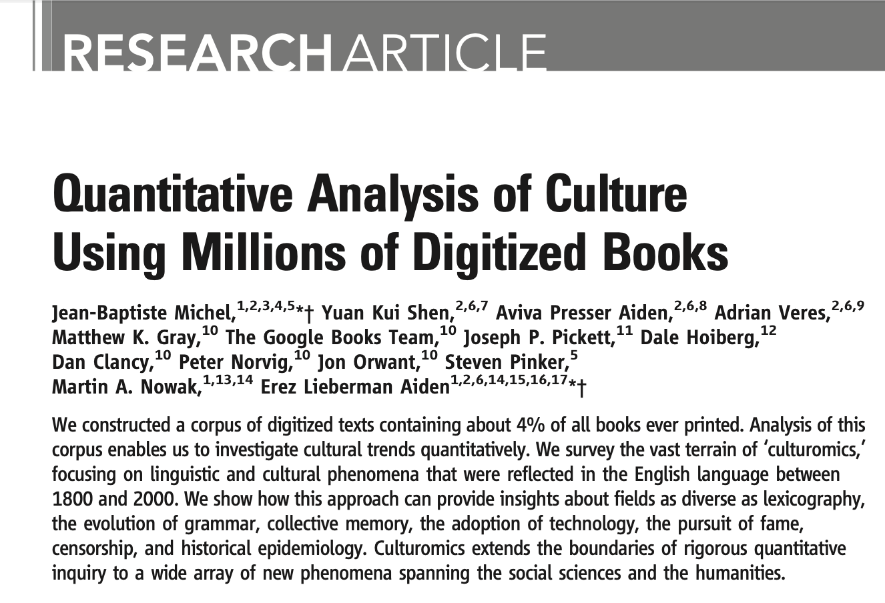

Word frequencies
========================================================
author: Christopher Barrie 
width: 2500
height: 900
transition: none  
  website: https://cjbarrie.com  
  github: https://github.com/cjbarrie       
  Twitter: https://www.twitter.com/cbarrie
  
Word frequency analysis
========================================================

- Tokenizing
- Counting words over space/time
- Denominating by totals

========================================================

<center>

</center>

Word frequency analysis
========================================================


```r
head(bookdata)
```

```
# A tibble: 6 x 1
  txt                  
  <chr>                
1 "PRIDE AND PREJUDICE"
2 ""                   
3 "By Jane Austen"     
4 ""                   
5 ""                   
6 ""                   
```

Word frequency analysis
========================================================


```r
bookdata %>%
  unnest_tokens(word, txt) %>%
  count(word, sort=T)
```

```
# A tibble: 6,538 x 2
   word      n
   <chr> <int>
 1 the    4331
 2 to     4162
 3 of     3610
 4 and    3585
 5 her    2203
 6 i      2065
 7 a      1954
 8 in     1880
 9 was    1843
10 she    1695
# … with 6,528 more rows
```

Word frequency analysis
========================================================


```r
bookdata %>%
  unnest_tokens(word, txt) %>%
  filter(!word %in% stop_words$word) %>%
  count(word, sort=T)
```

```
# A tibble: 6,009 x 2
   word          n
   <chr>     <int>
 1 elizabeth   597
 2 darcy       373
 3 bennet      294
 4 miss        283
 5 jane        264
 6 bingley     257
 7 time        203
 8 lady        183
 9 sister      180
10 wickham     162
# … with 5,999 more rows
```

========================================================

<center>

</center>
- Source: Michel et al. 2011. "Quantitative Analysis of Culture Using Millions of Digitized Books," *Science*, 331(6014):176-182.

========================================================

<center>

</center>

Running Your First Analysis: Edinburgh Book Festival
========================================================

```r
library(tidyverse) # loads dplyr, ggplot2, and others
library(tidytext) # includes set of functions useful for manipulating text
library(readr) # more informative and easy way to import data

edbfdata <- read_csv("https://raw.githubusercontent.com/cjbarrie/RDL-Ed/main/02-text-as-data/data/edbookfestall.csv")
```


Getting event descriptions
========================================================

```r
# get simplified dataset with only event contents and year
evdes <- edbfdata %>%
  select(description, year)

glimpse(evdes)
```

```
Rows: 5,938
Columns: 2
$ description <chr> "<p>\n\tAs the grande dame of Scottish crime fiction, Deni…
$ year        <dbl> 2012, 2012, 2012, 2012, 2012, 2012, 2012, 2012, 2012, 2012…
```


Tidying into tokens
========================================================

```r
tidy_des <- evdes %>% 
  mutate(desc = tolower(description)) %>%
  unnest_tokens(word, description) %>%
  filter(str_detect(word, "[a-z]"))
```


Removing stop words
========================================================

```r
tidy_des <- tidy_des %>%
    filter(!word %in% stop_words$word)
```

Checking data
========================================================

```r
tidy_des %>%
  count(word, sort = TRUE)
```

```
# A tibble: 24,995 x 2
   word       n
   <chr>  <int>
 1 rsquo   5638
 2 book    2088
 3 event   1356
 4 author  1332
 5 world   1240
 6 story   1159
 7 join    1095
 8 em      1064
 9 life     879
10 strong   864
# … with 24,985 more rows
```


Further cleaning
========================================================

```r
remove_reg <- c("&amp;","&lt;","&gt;","<p>", "</p>","&rsquo", "&lsquo;",  "&#39;", "<strong>", "</strong>", "rsquo", "em", "ndash", "nbsp", "lsquo", "strong")
reg_match <- paste0(remove_reg, collapse = "|")
                  
tidy_des <- tidy_des %>%
  filter(!word %in% remove_reg)
```

Checking data again
========================================================

```r
tidy_des %>%
  count(word, sort = TRUE)
```

```
# A tibble: 24,989 x 2
   word        n
   <chr>   <int>
 1 book     2088
 2 event    1356
 3 author   1332
 4 world    1240
 5 story    1159
 6 join     1095
 7 life      879
 8 stories   860
 9 chaired   815
10 books     767
# … with 24,979 more rows
```

REGEX
========================================================


```r
x <- c("I want t0 detect some number5 right ab0ut n0w")
str_detect(x, "\\d+")
```

```
[1] TRUE
```

```r
str_extract_all(x, "\\d+")
```

```
[[1]]
[1] "0" "5" "0" "0"
```

Check out:

1. Regex crossword: [https://regexcrossword.com/](https://regexcrossword.com/).
2. Regexone: [https://regexone.com/](https://regexone.com/)
3. R4DS [chapter 14](https://r4ds.had.co.nz/strings.html#matching-patterns-with-regular-expressions)


Back to the Fringe: computing counts
========================================================

```r
tidy_des %>%
  count(word, sort = TRUE) %>%
  filter(n > 600) %>%
  mutate(word = reorder(word, n))
```

```
# A tibble: 19 x 2
   word          n
   <fct>     <int>
 1 book       2088
 2 event      1356
 3 author     1332
 4 world      1240
 5 story      1159
 6 join       1095
 7 life        879
 8 stories     860
 9 chaired     815
10 books       767
11 edinburgh   723
12 writer      722
13 festival    710
14 writers     692
15 authors     688
16 reading     681
17 scottish    625
18 winning     620
19 series      617
```

Plot
========================================================


```r
tidy_des %>%
  count(word, sort = TRUE) %>%
  filter(n > 700) %>%
  mutate(word = reorder(word, n)) %>%
  ggplot(aes(n, word)) +
  geom_col() +
  labs(y = NULL)
```

========================================================


Tag target words
========================================================


```r
edbf_term_counts <- tidy_des %>% 
  group_by(year) %>%
  count(word, sort = TRUE)
```


```r
edbf_term_counts$womword <- as.integer(grepl("women|gender",
                                             x = edbf_term_counts$word))
```

Count words as proportion of total
========================================================

```r
edbf_counts <- edbf_term_counts %>%
  complete(year, word, fill = list(n = 0)) %>%
  group_by(year) %>%
  mutate(year_total = sum(n)) %>%
  filter(womword==1) %>%
  summarise(sum_wom = sum(n),
            year_total= min(year_total))
```

Plot
========================================================

```r
ggplot(edbf_counts, aes(year, sum_wom / year_total, group=1)) +
  geom_line() +
  xlab("Year") +
  ylab("% gender-related words") +
  scale_y_continuous(labels = scales::percent_format(),
                     expand = c(0, 0), limits = c(0, NA))
```

========================================================


Worksheets
========================================================

- [https://github.com/cjbarrie/ED-AMW](https://github.com/cjbarrie/ED-AMW)
