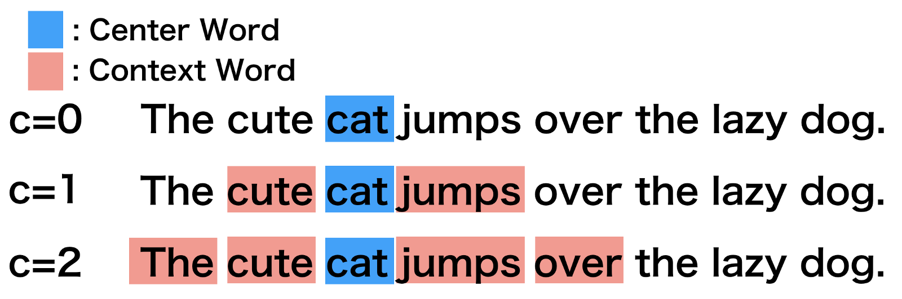
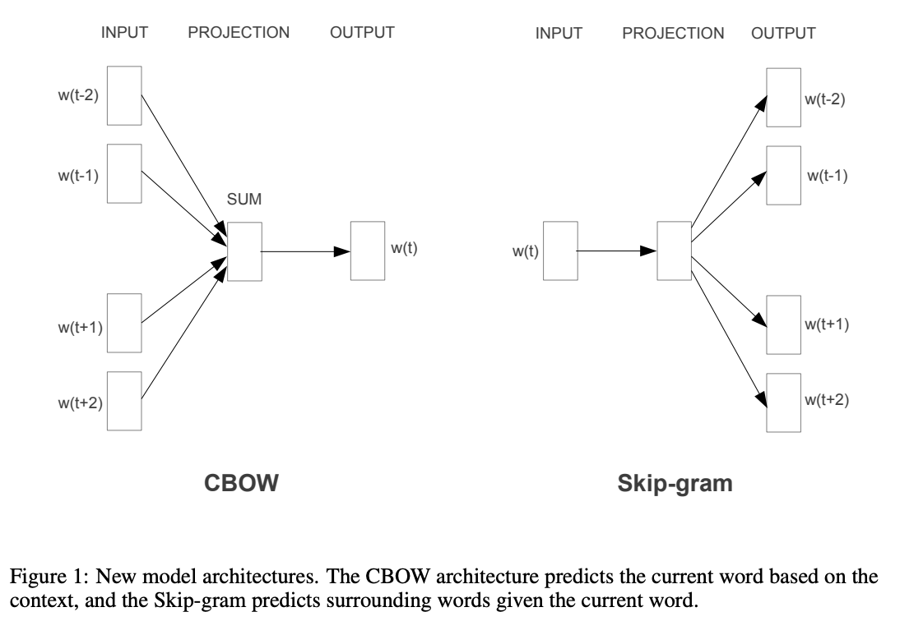

Word embedding
========================================================
author: Christopher Barrie 
width: 2500
height: 900
transition: none  
  website: https://cjbarrie.com  
  github: https://github.com/cjbarrie       
  Twitter: https://www.twitter.com/cbarrie

Word embedding
========================================================

- "you shall know a word by the company it keeps" (Firth, 1957)
    - Generates matrix of word vectors
      - where words closer together in vector space are more "similar" or "related"
      
How does it work?
========================================================

- Various approaches, including:
  - 1. SVD
  - 2. Neural network-based techniques like GloVe and Word2Vec
  
What do both approaches do?
========================================================

1. Define a context window
2. Looks at probabilities of word appearing near another word

========================================================

- Define a context window:


  
========================================================

- Looks at probabilities of word appearing near another word


```
6 x 6 sparse Matrix of class "dgCMatrix"
               the          to          and          of      https           a
the    0.653259169 -0.01948121 -0.006446459  0.27136395 -0.5246159 -0.32557524
to    -0.019481205  0.75498084 -0.065170433 -0.25694210 -0.5731182 -0.04595798
and   -0.006446459 -0.06517043  1.027782342 -0.03974904 -0.4915159 -0.05862969
of     0.271363948 -0.25694210 -0.039749043  1.02111517 -0.5045067  0.09829389
https -0.524615878 -0.57311817 -0.491515918 -0.50450674  0.5451841 -0.57956404
a     -0.325575239 -0.04595798 -0.058629689  0.09829389 -0.5795640  1.03048355
```
  
    
Implementation: SVD approach
========================================================

- Data structure:
  - Word pair matrix with PMI (Pairwise mutual information)
  - where   PMI = log(P(x,y)/P(x)P(y))
  - and   P(x,y)   is the probability of word x appearing within a six-word window of word y
  - and   P(x)   is the probability of word x appearing in the whole corpus
  - and   P(y)   is the probability of word y appearing in the whole corpus
    
The resulting matrix structure will look something like this:
    

```
6 x 6 sparse Matrix of class "dgCMatrix"
               the          to          and          of      https           a
the    0.653259169 -0.01948121 -0.006446459  0.27136395 -0.5246159 -0.32557524
to    -0.019481205  0.75498084 -0.065170433 -0.25694210 -0.5731182 -0.04595798
and   -0.006446459 -0.06517043  1.027782342 -0.03974904 -0.4915159 -0.05862969
of     0.271363948 -0.25694210 -0.039749043  1.02111517 -0.5045067  0.09829389
https -0.524615878 -0.57311817 -0.491515918 -0.50450674  0.5451841 -0.57956404
a     -0.325575239 -0.04595798 -0.058629689  0.09829389 -0.5795640  1.03048355
```

Implementation: SVD approach
========================================================

And the resulting matrix object will take the following format:


```
Formal class 'dgCMatrix' [package "Matrix"] with 6 slots
  ..@ i       : int [1:350700] 0 1 2 3 4 5 6 7 8 9 ...
  ..@ p       : int [1:21173] 0 7819 14360 20175 25467 29910 34368 39207 43376 46401 ...
  ..@ Dim     : int [1:2] 21172 21172
  ..@ Dimnames:List of 2
  .. ..$ : chr [1:21172] "the" "to" "and" "of" ...
  .. ..$ : chr [1:21172] "the" "to" "and" "of" ...
  ..@ x       : num [1:350700] 0.65326 -0.01948 -0.00645 0.27136 -0.52462 ...
  ..@ factors : list()
```

Implementation: neural-net GloVe approach
========================================================

<center>

</center>

Extensions
========================================================

- "conText": from [Rodriguez et al.](https://github.com/prodriguezsosa/EmbeddingRegression) and dedicated R package [here](https://github.com/prodriguezsosa/conText)
- Concept mover's distance: see [Taylor and Stoltz](https://link.springer.com/article/10.1007/s42001-019-00048-6) and dedicated R package [here](https://github.com/dustinstoltz/CMDist)

Worksheets
========================================================

- [https://github.com/cjbarrie/ED-AMWs](https://github.com/cjbarrie/ED-AMWs)
