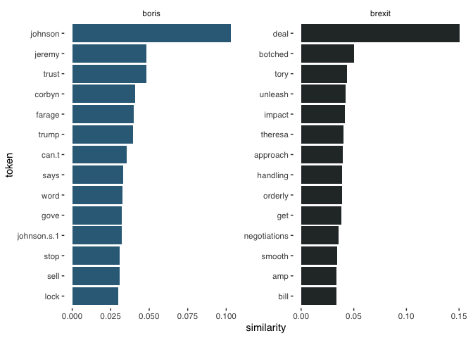
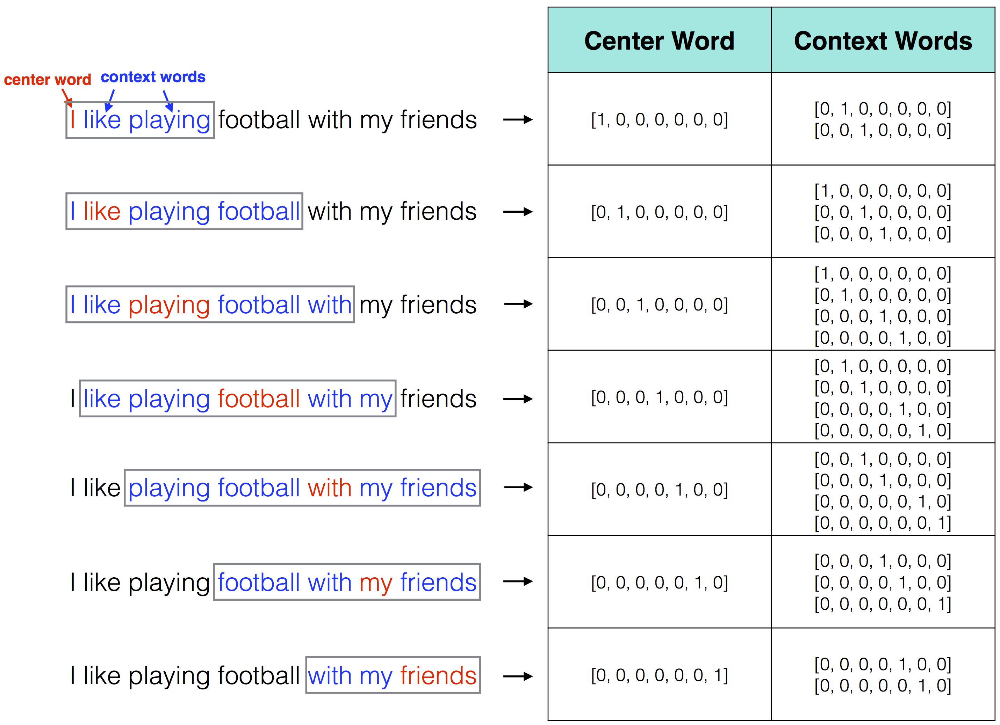
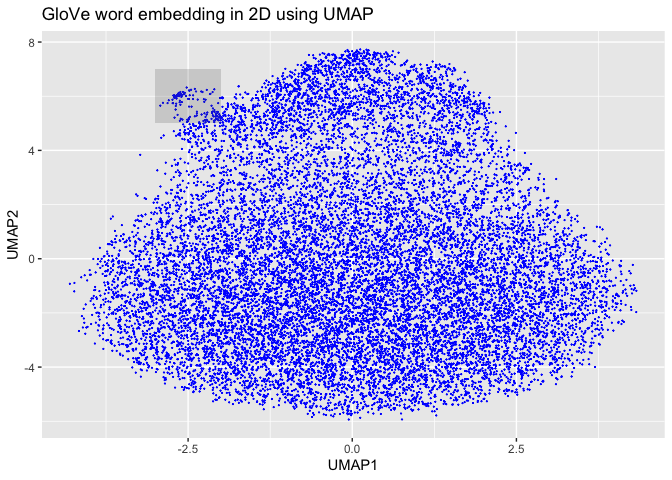
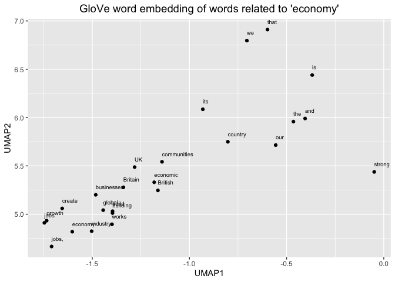

# Exercise 4: Word embedding

The lecture mentioned work by @Garg2018 and @Caliskan2017. Both articles use different forms of word embedding techniques.

## Introduction

In this tutorial, you will learn how to:

* Generate word vectors (embeddings) via SVD
* Train a local word embedding model in GloVe
* Visualize and inspect results
* Load and examine pre-trained embeddings

Note: Adapts from tutorials by Chris Bail [here](https://cbail.github.io/textasdata/word2vec/rmarkdown/word2vec.html) and Julia Silge [here](https://juliasilge.com/blog/tidy-word-vectors/) and Emil Hvitfeldt and Julia Silge [here](https://smltar.com/).

## Setup 


```r
library(tidyverse) # loads dplyr, ggplot2, and others
library(stringr) # to handle text elements
library(tidytext) # includes set of functions useful for manipulating text
library(ggthemes) # to make your plots look nice
library(text2vec) # for word embedding implementation
library(widyr) # for reshaping the text data
library(irlba) # for svd
library(umap) # for dimensionality reduction
```

We begin by reading in the data. These data come from a sample of 1m tweets by elected UK MPs over the period 2017-2019. The data contain just the name of the MP-user, the text of the tweet, and the MP's party. We then just add an ID variable called "postID."


```r
twts_sample <- readRDS("data/twts_corpus_sample.rds")

#create tweet id
twts_sample$postID <- row.names(twts_sample)
```

## Word vectors via SVD

We're going to set about generating a set of word vectors with from our text data. Note that many word embedding applications will use pre-trained embeddings from a much larger corpus, or will generate local embeddings using neural net-based approaches. 

Here, we're instead going to generate a set of embeddings or word vectors by making a series of calculations based on the frequencies with which words appear in different contexts. We will then use a technique called the "Singular Value Decomposition" (SVD). This is a dimensionality reduction technique where the first axis of the resulting composition is designed to capture the most variance, the second the second-most etc...

How do we achieve this?

## Implementation

The first thing we need to do is to get our data in the right format to calculate so-called "skip-gram probabilties." If you go through the code line by the line in the below you will begin to understand what these are. 

What's going on?

Well, we're first unnesting our tweet data as in previous exercises. But importantly, here, we're not unnesting to individual tokens but to ngrams of length 6 or, in other words, for postID n with words k indexed by i, we take words i, 1+1...1+6, then we take words 1+1...1+7. Try just running the first two lines of the code below to see what this means in practice. 

After this, we make a unique ID for the particular ngram we create for each postID, and then we make a unique skipgramID for each postID and ngram. And then we unnest the words of each ngram associated with each skipgramID.

You can see the resulting output below.


```r
#create context window with length 6
tidy_skipgrams <- twts_sample %>%
    unnest_tokens(ngram, tweet, token = "ngrams", n = 6) %>%
    mutate(ngramID = row_number()) %>% 
    tidyr::unite(skipgramID, postID, ngramID) %>%
    unnest_tokens(word, ngram)

head(tidy_skipgrams, n=20)
```


```
## # A tibble: 20 × 4
##    username  party_value             skipgramID word   
##    <chr>     <chr>                   <chr>      <chr>  
##  1 kirstysnp Scottish National Party 1_1        in     
##  2 kirstysnp Scottish National Party 1_1        amongst
##  3 kirstysnp Scottish National Party 1_1        all    
##  4 kirstysnp Scottish National Party 1_1        the    
##  5 kirstysnp Scottish National Party 1_1        horror 
##  6 kirstysnp Scottish National Party 1_1        at     
##  7 kirstysnp Scottish National Party 1_2        amongst
##  8 kirstysnp Scottish National Party 1_2        all    
##  9 kirstysnp Scottish National Party 1_2        the    
## 10 kirstysnp Scottish National Party 1_2        horror 
## 11 kirstysnp Scottish National Party 1_2        at     
## 12 kirstysnp Scottish National Party 1_2        the    
## 13 kirstysnp Scottish National Party 1_3        all    
## 14 kirstysnp Scottish National Party 1_3        the    
## 15 kirstysnp Scottish National Party 1_3        horror 
## 16 kirstysnp Scottish National Party 1_3        at     
## 17 kirstysnp Scottish National Party 1_3        the    
## 18 kirstysnp Scottish National Party 1_3        notion 
## 19 kirstysnp Scottish National Party 1_4        the    
## 20 kirstysnp Scottish National Party 1_4        horror
```

What next?

Well we can now calculate a set of probabilities from our skipgrams. We do so with the `pairwise_count()` function from the <tt>widyr</tt> package. Essentially, this function is saying: for each skipgramID count the number of times a word appears with another word for that feature (where the feature is the skipgramID). We set `diag` to `TRUE` when we also want to count the number of times a word appears near itself. 

The probability we are then calculating is the number of times a word appears with another word denominated by the total number of word pairings across the whole corpus. 


```r
#calculate probabilities
skipgram_probs <- tidy_skipgrams %>%
    pairwise_count(word, skipgramID, diag = TRUE, sort = TRUE) %>% # diag = T means that we also count when the word appears twice within the window
    mutate(p = n / sum(n))

head(skipgram_probs[1000:1020,], n=20)
```

```
## Warning: `distinct_()` was deprecated in dplyr 0.7.0.
## Please use `distinct()` instead.
## See vignette('programming') for more help
## This warning is displayed once every 8 hours.
## Call `lifecycle::last_lifecycle_warnings()` to see where this warning was generated.
```

```
## # A tibble: 20 × 4
##    item1   item2       n         p
##    <chr>   <chr>   <dbl>     <dbl>
##  1 no      to       4100 0.0000531
##  2 vote    for      4099 0.0000531
##  3 for     vote     4099 0.0000531
##  4 see     the      4078 0.0000528
##  5 the     see      4078 0.0000528
##  6 having  having   4076 0.0000528
##  7 by      of       4065 0.0000527
##  8 of      by       4065 0.0000527
##  9 this    with     4051 0.0000525
## 10 with    this     4051 0.0000525
## 11 set     set      4050 0.0000525
## 12 right   the      4045 0.0000524
## 13 the     right    4045 0.0000524
## 14 what    the      4044 0.0000524
## 15 going   to       4044 0.0000524
## 16 the     what     4044 0.0000524
## 17 to      going    4044 0.0000524
## 18 evening evening  4035 0.0000523
## 19 get     the      4032 0.0000522
## 20 the     get      4032 0.0000522
```

So we see, for example, the words vote and for appear 4099 times together. Denominating that by the total n of word pairings (or `sum(skipgram_probs$n)`), gives us our probability p. 

Okay, now we have our skipgram probabilities we need to get our "unigram probabilities" in order to normalize the skipgram probabilities before applying the singular value decomposition. 

What is a "unigram probability"? Well, this is just a technical way of saying: count up all the appearances of a given word in our corpus then divide that by the total number of words in our corpus. And we can do this as such:


```r
#calculate unigram probabilities (used to normalize skipgram probabilities later)
unigram_probs <- twts_sample %>%
    unnest_tokens(word, tweet) %>%
    count(word, sort = TRUE) %>%
    mutate(p = n / sum(n))
```

Finally, it's time to normalize our skipgram probabilities. 

We take our skipgram probabilities, we filter out word pairings that appear twenty times or less. We rename our words "item1" and "item2," we merge in the unigram probabilities for both words. 

And then we calculate the joint probability as the skipgram probability divided by the unigram probability for the first word in the pairing divided by the unigram probability for the second word in the pairing. This is equivalent to: P(x,y)/P(x)P(y). 

In essence, the interpretation of this value is: *"do events (words) x and y occur together more often than we would expect if they were independent"*?

Once we've recovered these normalized probabilities, we can have a look at the joint probabilities for a given item, i.e., word. Here, we look at the word "brexit" and look at those words with the highest value for "p_together."

Higher values greater than 1 indicate that the words are more likely to appear close to each other; low values less than 1 indicate that they are unlikely to appear close to each other. This, in other words, gives an indication of the association of two words.


```r
#normalize skipgram probabilities
normalized_prob <- skipgram_probs %>%
    filter(n > 20) %>% #filter out skipgrams with n <=20
    rename(word1 = item1, word2 = item2) %>%
    left_join(unigram_probs %>%
                  select(word1 = word, p1 = p),
              by = "word1") %>%
    left_join(unigram_probs %>%
                  select(word2 = word, p2 = p),
              by = "word2") %>%
    mutate(p_together = p / p1 / p2)

normalized_prob %>% 
    filter(word1 == "brexit") %>%
    arrange(-p_together)
```

```
## # A tibble: 1,016 × 7
##    word1  word2                      n           p      p1         p2 p_together
##    <chr>  <chr>                  <dbl>       <dbl>   <dbl>      <dbl>      <dbl>
##  1 brexit brexit                 38517 0.000499    0.00279 0.00279          64.0
##  2 brexit softer                    50 0.000000648 0.00279 0.00000484       48.0
##  3 brexit dividend                 176 0.00000228  0.00279 0.0000201        40.7
##  4 brexit scotlandsplaceineurope    37 0.000000479 0.00279 0.00000446       38.5
##  5 brexit botched                  129 0.00000167  0.00279 0.0000208        28.7
##  6 brexit gridlock                  30 0.000000389 0.00279 0.00000521       26.7
##  7 brexit deadlock                 120 0.00000155  0.00279 0.0000242        23.0
##  8 brexit preparedness              22 0.000000285 0.00279 0.00000446       22.9
##  9 brexit soft                      89 0.00000115  0.00279 0.0000190        21.8
## 10 brexit weaken                    24 0.000000311 0.00279 0.00000521       21.4
## # … with 1,006 more rows
```

Using this normalized probabilities, we then calculate the PMI or "Pointwise Mutual Information" value, which is simply the log of the joint probability we calculated above. 

**Definition time**: "PMI is logarithm of the probability of finding two words together, normalized for the probability of finding each of the words alone."

We then cast our word pairs into a sparse matrix where values correspond to the PMI between two corresponding words. 


```r
pmi_matrix <- normalized_prob %>%
    mutate(pmi = log10(p_together)) %>%
    cast_sparse(word1, word2, pmi)

#remove missing data
pmi_matrix@x[is.na(pmi_matrix@x)] <- 0
#run SVD
pmi_svd <- irlba(pmi_matrix, 256, maxit = 500)

glimpse(pmi_matrix)
```


```
## Formal class 'dgCMatrix' [package "Matrix"] with 6 slots
##   ..@ i       : int [1:350700] 0 1 2 3 4 5 6 7 8 9 ...
##   ..@ p       : int [1:21173] 0 7819 14360 20175 25467 29910 34368 39207 43376 46401 ...
##   ..@ Dim     : int [1:2] 21172 21172
##   ..@ Dimnames:List of 2
##   .. ..$ : chr [1:21172] "the" "to" "and" "of" ...
##   .. ..$ : chr [1:21172] "the" "to" "and" "of" ...
##   ..@ x       : num [1:350700] 0.65326 -0.01948 -0.00645 0.27136 -0.52462 ...
##   ..@ factors : list()
```

Notice here that we are setting the vector size to equal 256. This just means that we have a vector length of 256 for any given word. 

That is, the set of numbers used to represent a word has length limited to 256. This is arbitrary and can be changed. Typically, a size in the low hundreds is chosen when representing a word as a vector. 

The word vectors are then taken as the "u" column, or the left-singular vectors, of the SVD.


```r
#next we output the word vectors:
word_vectors <- pmi_svd$u
rownames(word_vectors) <- rownames(pmi_matrix)

dim(word_vectors)
```

```
## [1] 21172   256
```

## Exploration 

We can define a simple function below to then take our word vector, and find the most similar words, or nearest neighbours, for a given word:


```r
nearest_words <- function(word_vectors, word){
  selected_vector = word_vectors[word,]
  mult = as.data.frame(word_vectors %*% selected_vector) #dot product of selected word vector and all word vectors
  
  mult %>%
  rownames_to_column() %>%
  rename(word = rowname,
         similarity = V1) %>%
    anti_join(get_stopwords(language = "en")) %>%
  arrange(-similarity)

}

boris_synonyms <- nearest_words(word_vectors, "boris")
```

```
## Joining, by = "word"
```

```r
brexit_synonyms <- nearest_words(word_vectors, "brexit")
```

```
## Joining, by = "word"
```

```r
head(boris_synonyms, n=10)
```

```
##       word similarity
## 1  johnson 0.10309556
## 2    boris 0.09940448
## 3   jeremy 0.04823204
## 4    trust 0.04800155
## 5   corbyn 0.04102031
## 6   farage 0.03973588
## 7    trump 0.03938184
## 8    can.t 0.03533624
## 9     says 0.03324624
## 10    word 0.03267437
```

```r
head(brexit_synonyms, n=10)
```

```
##        word similarity
## 1    brexit 0.38737979
## 2      deal 0.15083433
## 3   botched 0.05003683
## 4      tory 0.04377030
## 5   unleash 0.04233445
## 6    impact 0.04139872
## 7   theresa 0.04017608
## 8  approach 0.03970233
## 9  handling 0.03901461
## 10  orderly 0.03897535
```

```r
#then we can visualize
brexit_synonyms %>%
  mutate(selected = "brexit") %>%
  bind_rows(boris_synonyms %>%
              mutate(selected = "boris")) %>%
  group_by(selected) %>%
  top_n(15, similarity) %>%
  mutate(token = reorder(word, similarity)) %>%
  filter(token!=selected) %>%
  ggplot(aes(token, similarity, fill = selected)) +
  geom_col(show.legend = FALSE) +
  facet_wrap(~selected, scales = "free") +
  scale_fill_manual(values = c("#336B87", "#2A3132")) +
  coord_flip() +
  theme_tufte(base_family = "Helvetica")
```

<!-- -->


## GloVe Embeddings

This section adapts from tutorials by Pedro Rodriguez [here](https://github.com/prodriguezsosa/conText/blob/master/vignettes/quickstart_local_transform.md) and Dmitriy Selivanov [here](http://text2vec.org/glove.html) and Wouter van Gils [here](https://medium.com/broadhorizon-cmotions/nlp-with-r-part-2-training-word-embedding-models-and-visualize-results-ae444043e234).

## GloVe algorithm

This section is taken from <tt>text2vec</tt> package page [here](http://text2vec.org/glove.html) by @text2vec.

The GloVe algorithm by @pennington-etal-2014-glove consists of the following steps:

1. Collect word co-occurence statistics in a form of word co-ocurrence matrix $X$. Each element $X_{ij}$ of such matrix represents how often word *i* appears in context of word *j*. Usually we scan our corpus in the following manner: for each term we look for context terms within some area defined by a *window_size* before the term and a *window_size* after the term. Also we give less weight for more distant words, usually using this formula: $$decay = 1/offset$$

2. Define soft constraints for each word pair:  $$w_i^Tw_j + b_i + b_j = log(X_{ij})$$ Here $w_i$ - vector for the main word, $w_j$ - vector for the context word, $b_i$, $b_j$ are scalar biases for the main and context words.

3. Define a cost function 
$$J = \sum_{i=1}^V \sum_{j=1}^V \; f(X_{ij}) ( w_i^T w_j + b_i + b_j - \log X_{ij})^2$$
Here $f$ is a weighting function which help us to prevent learning only from extremely common word pairs. The GloVe authors choose the following function:

$$
f(X_{ij}) = 
\begin{cases}
(\frac{X_{ij}}{x_{max}})^\alpha & \text{if } X_{ij} < XMAX \\
1 & \text{otherwise}
\end{cases}
$$

How do we go about implementing this algorithm in R?

Let's first make sure we have loaded the packages we need:


```r
library(text2vec) # for implementation of GloVe algorithm
library(stringr) # to handle text strings
library(umap) # for dimensionality reduction later on
```

## Implementation

We then need to set some of the choice parameters of the GloVe model. The first is the window size `WINDOW_SIZE`, which, as above, is arbitrary but normally set around 6-8. This means we are looking for word context of words up to 6 words around the target word. The image below illustrates this choice parameter for the word "cat" in a given sentence, with increase context window size:


And this will ultimately be understood in matrix format as:



The iterations parameter `ITERS` simply sets the maximum number of iterations to allow for model convergence. This number of iterations is relatively high and the model will likely converge before 100 iterations. 

The `DIM` parameter specifies the length of the word vector we want to result (i.e., just as we set a limit of 256 for the SVD approach above). Finally, `COUNT_MIN` is specifying the minimum count of words that we want to keep. In other words, if a word appears fewer than ten times, it is discarded. Again, this is the same as above where we discarded word pairings that appeared fewer than twenty times.


```r
# ================================ choice parameters
# ================================
WINDOW_SIZE <- 6
DIM <- 300
ITERS <- 100
COUNT_MIN <- 10
```

We next "shuffle" our text. This just means we are randomly reordering the character vector of tweets. 


```r
# shuffle text
set.seed(42L)
text <- sample(twts_sample$tweet)
```

We then create a list object, tokenizing the text of each tweet within each item of the list. After this, we create the vocabulary object needed to implement the GloVe algorithm. We do this by creating an "itoken" object with `itoken()` and then creating a vocabulary with `create_vocabulary`. We then remove words that do not exceed our specified threshold above with `prune_vocabulary()`. 


```r
# ================================ create vocab ================================
tokens <- space_tokenizer(text)
it <- itoken(tokens, progressbar = FALSE)
vocab <- create_vocabulary(it)
vocab_pruned <- prune_vocabulary(vocab, term_count_min = COUNT_MIN)  # keep only words that meet count threshold
```

Next up we vectorize our vocabulary and create our term co-occurrence matrix. Again, this is similar to the above where we created a matrix of PMIs for each of the word pairings in our corpus. 


```r
# ================================ create term co-occurrence matrix
# ================================
vectorizer <- vocab_vectorizer(vocab_pruned)
tcm <- create_tcm(it, vectorizer, skip_grams_window = WINDOW_SIZE, skip_grams_window_context = "symmetric", 
    weights = rep(1, WINDOW_SIZE))
```

Then we set our final model parameters, learning rate and fit the model. This whole process will take some time. To save time when working through this tutorial, you may also download the resulting embedding from the Github repo linked a little further below.


```r
# ================================ set model parameters
# ================================
glove <- GlobalVectors$new(rank = DIM, x_max = 100, learning_rate = 0.05)

# ================================ fit model ================================
word_vectors_main <- glove$fit_transform(tcm, n_iter = ITERS, convergence_tol = 0.001, 
    n_threads = RcppParallel::defaultNumThreads())
```

Finally, we get the resulting word embedding and save it as a .rds file.


```r
# ================================ get output ================================
word_vectors_context <- glove$components
glove_embedding <- word_vectors_main + t(word_vectors_context)  # word vectors

# ================================ save ================================
saveRDS(glove_embedding, file = "local_glove.rds")
```

**To save time when working through this tutorial, you may also download the resulting embedding from the Github repo with**:


```r
url <- "https://github.com/cjbarrie/sicss_21/blob/main/02_text_as_data/04-word-embed/data/local_glove.rds?raw=true"
glove_embedding <- readRDS(url(url, method="libcurl"))
```


## Visualization


How do we explore these embeddings? Well, imagine that our embeddings will look something not dissimilar to this visualization of another embedding [here](https://anvaka.github.io/pm/#/galaxy/word2vec-wiki?cx=-17&cy=-237&cz=-613&lx=-0.0575&ly=-0.9661&lz=-0.2401&lw=-0.0756&ml=300&s=1.75&l=1&v=d50_clean). In other words, we are talking about something that doesn't lend itself to projection in 2D space!

But...

All hope is not lost, space travellers. A smart technique by @mcinnes2020umap linked [here](https://arxiv.org/abs/1802.03426) describes a way to reduce the dimensionality of such embedding layers using what is called "Uniform Manifold Approximation and Projection." How do we do this? Well, happily, with the <tt>umap</tt> package by @umap2020 it is pretty straightforward!


```r
# GloVe dimension reduction
glove_umap <- umap(glove_embedding, n_components = 2, metric = "cosine", n_neighbors = 25, min_dist = 0.1, spread=2)
```


Why is this helpful? Well, for a number of reasons, but it is particularly helpful here for visualizing our embeddings in two-dimensional space. 


```r
# Put results in a dataframe for ggplot
df_glove_umap <- as.data.frame(glove_umap[["layout"]])

# Add the labels of the words to the dataframe
df_glove_umap$word <- rownames(df_glove_umap)
colnames(df_glove_umap) <- c("UMAP1", "UMAP2", "word")

# Plot the UMAP dimensions
ggplot(df_glove_umap) +
  geom_point(aes(x = UMAP1, y = UMAP2), colour = 'blue', size = 0.05) +
  ggplot2::annotate("rect", xmin = -3, xmax = -2, ymin = 5, ymax = 7,alpha = .2) +
  labs(title = "GloVe word embedding in 2D using UMAP")
```

<!-- -->

```r
# Plot the shaded part of the GloVe word embedding with labels
ggplot(df_glove_umap[df_glove_umap$UMAP1 < -2.5 & df_glove_umap$UMAP1 > -3 & df_glove_umap$UMAP2 > 5 & df_glove_umap$UMAP2 < 6.5,]) +
      geom_point(aes(x = UMAP1, y = UMAP2), colour = 'blue', size = 2) +
      geom_text(aes(UMAP1, UMAP2, label = word), size = 2.5, vjust=-1, hjust=0) +
      labs(title = "GloVe word embedding in 2D using UMAP - partial view") +
      theme(plot.title = element_text(hjust = .5, size = 14))
```

<!-- -->

```r
# Plot the word embedding of words that are related for the GloVe model
word <- glove_embedding["economy",, drop = FALSE]
cos_sim = sim2(x = glove_embedding, y = word, method = "cosine", norm = "l2")
select <- data.frame(rownames(as.data.frame(head(sort(cos_sim[,1], decreasing = TRUE), 25))))
colnames(select) <- "word"
selected_words <- df_glove_umap %>% inner_join(y=select, by= "word", match = "all") 

#The ggplot visual for GloVe
ggplot(selected_words, aes(x = UMAP1, y = UMAP2)) + 
      geom_point(show.legend = FALSE) + 
      geom_text(aes(UMAP1, UMAP2, label = word), show.legend = FALSE, size = 2.5, vjust=-1.5, hjust=0) +
      labs(title = "GloVe word embedding of words related to 'economy'") +
      theme(plot.title = element_text(hjust = .5, size = 14))
```

<!-- -->


We can see, here, then that our embeddings seem to make sense. We zoomed in first on that little outgrowth of our 2D mapping, which seemed to correspond to numbers and number words. Then we looked at words around "economy" and we see other related terms like "growth" and "jobs."

## Exercises

1. Inspect and visualize the nearest neighbour synonyms of other relevant words in the tweets corpus
2. Identify another region of interest in the GloVe-trained model and visualize

## References 
